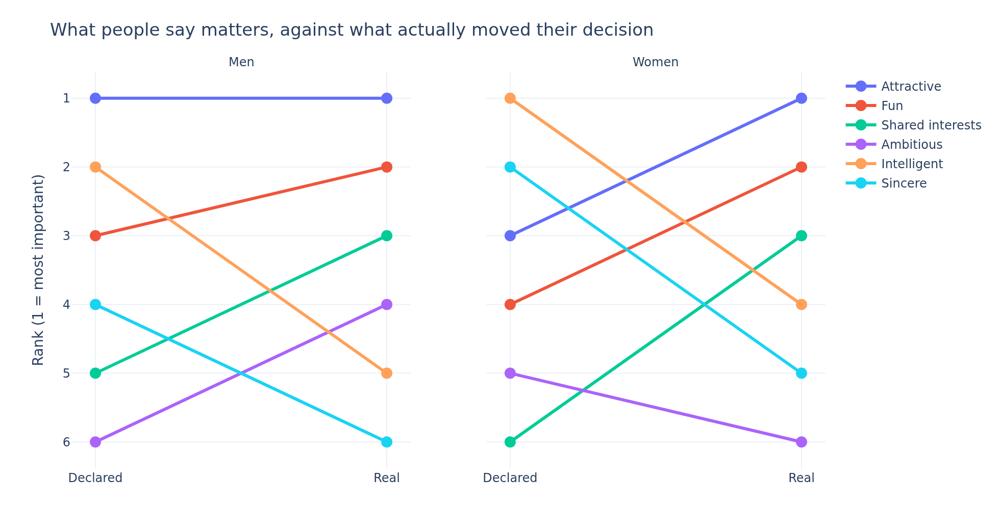
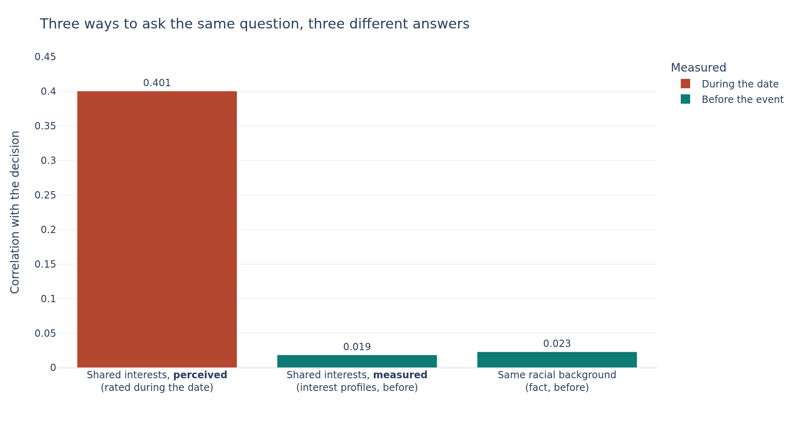
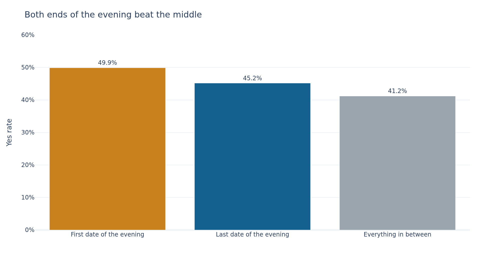

# What makes people want a second date?

Exploratory analysis of the Columbia University speed dating experiment (2002-2004), run for
Tinder's marketing team.

Jedha *Full Stack Data Scientist* — **Block 2, Exploratory Data Analysis**.

The full analysis, with every cleaning decision and its measured effect, is in
[`tinder_project.ipynb`](tinder_project.ipynb).

## The problem

Tinder's marketing team is seeing the number of matches go down and wants to understand **what
makes people interested in each other**. The app itself cannot answer that — all it observes is a
swipe with no reason attached. So they fall back on an experiment where the same people were asked,
in writing, what they were looking for, and then observed deciding face to face, four minutes at a
time.

The value of the dataset is exactly that gap: it records both **what people say they want** and
**what they actually pick**.

## The dataset

`data/Speed+Dating+Data.csv` — 8 378 rows x 195 columns, 551 participants, 21 waves.
`data/Speed+Dating+Data+Key.doc` is the official codebook and the reference for every scale used.

Two properties drive the whole analysis:

- **One row is one directed date**, not one couple. Every four-minute date is recorded twice, once
  from each side (8 368 distinct `(iid, pid)` pairs, all with their reciprocal row). The unit of
  observation is *"how I rated my partner, and what I decided"*.
- **Waves are not the same size.** Participants met between 5 and 22 partners, so `order` — the rank
  of a date within the evening — does not mean the same thing across waves.

Participants said yes on **42%** of their dates; **16.5%** ended in a mutual match.

## What we found

### 1. What people declare is a poor guide to what they choose — women more than men



Men declare attractiveness first and use it first: no gap. Women declare it *third*, behind
intelligence and sincerity, and it drives their decisions more strongly than any other attribute.
Intelligence makes the opposite trip for both, from the top of the declared list to fourth or fifth
in practice.

Two independent methods agree: correlation with the decision, and participants' own day-after
accounting, which moves attractiveness **+8.3 points** of budget.

### 2. Perceived common ground predicts a second date. Actual common ground does not.



Compared naively, shared interests crush racial background by a factor of seventeen. Compared
fairly — both measured *before* anyone met — interests genuinely in common (+0.019) predict a second
date no better than a shared racial background (+0.023), and both are indistinguishable from
nothing.

What predicts a yes is not whether two people have things in common. It is whether one of them came
away *thinking so*.

### 3. Nobody knows what they are worth

Participants rate themselves about a point above what the room gives them, on every attribute, and
**72% overestimate their own attractiveness**. The bias is uniform rather than concentrated on
particular traits, and the individual spread is larger than the bias itself.

### 4. Position in the queue is not neutral, and the pattern is a U



The first date of the evening gets a yes 49.9% of the time and the last 45.2%, against 41.2% in
between. Once relative position is used instead of raw rank, the apparent fatigue slope disappears
entirely — what remains is that the ends of the evening are judged more generously than the middle.

## What this data cannot tell us

Worth saying before any of it reaches a roadmap: it is **twenty years old**, collected from Columbia
graduate students; **four minutes face to face is not a swipe**; the measured effects are **small**,
with the strongest pre-event predictor barely clearing +0.02; and nothing here was randomised except
the pairing, so none of it is causal.

## Running it

```bash
python3 -m venv .venv
.venv/bin/pip install -r requirements.txt
```

Then open `tinder_project.ipynb` and select the `.venv` kernel. The notebook reads only the CSV in
`data/` — no API call, no credential and no network access anywhere in this project.

Charts render as static images so the notebook stays readable on GitHub; the same PNGs are written
to `images/`. If `kaleido` cannot find a browser, run `.venv/bin/plotly_get_chrome`.

## Layout

```
data/                   the dataset and its codebook
images/                 charts, regenerated on every run
tinder_project.ipynb    the deliverable: cleaning, EDA, the five questions, recommendations
requirements.txt        pinned dependencies
```
